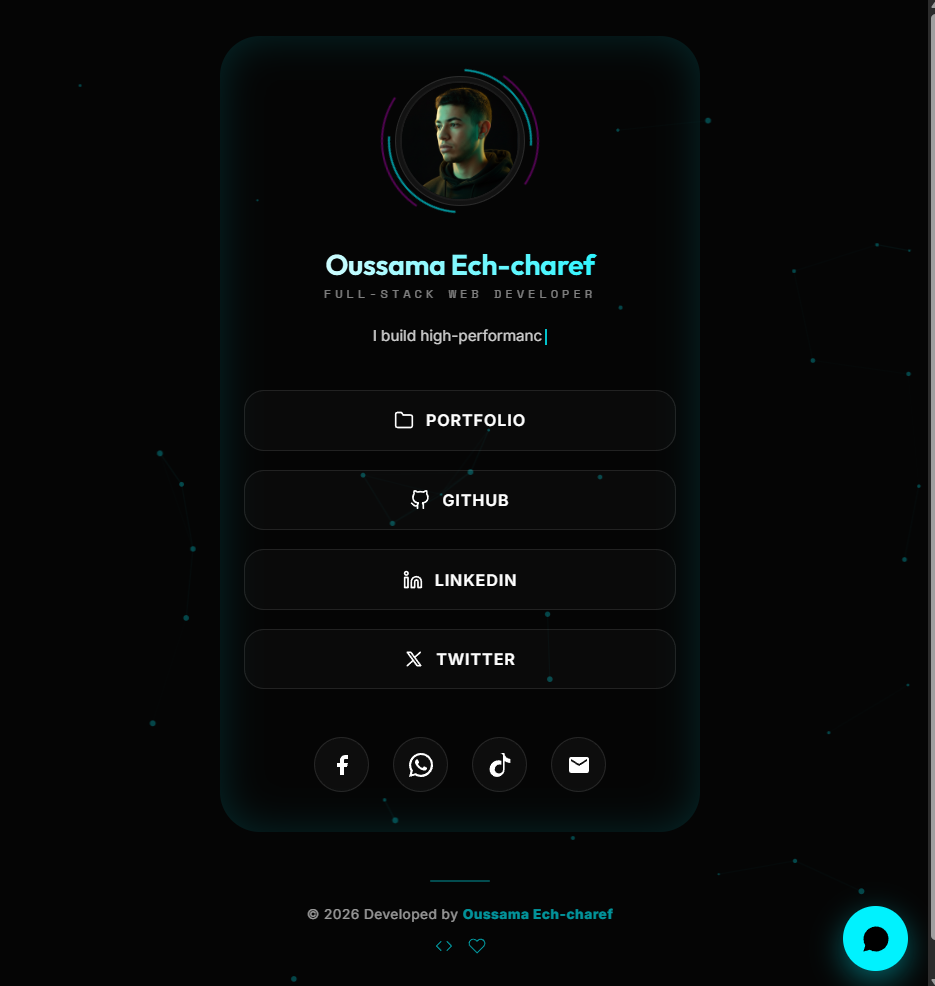

<div align="center">

# ⚡ Digital Architect — Link in Bio

**A premium, cinematic personal landing page built for elite professionals.**

[](https://e-charef-ou.infinityfreeapp.com/?i=1)
[](https://developer.mozilla.org/en-US/docs/Web/HTML)
[](https://developer.mozilla.org/en-US/docs/Web/CSS)
[](https://developer.mozilla.org/en-US/docs/Web/JavaScript)

<br/>



</div>

---

## 🎯 Overview

This is a **high-performance, single-file personal link hub** designed for **Oussama Ech-charef**, a Full-Stack Web Developer. It functions as a premium alternative to Linktree — built entirely from scratch with zero frameworks and zero dependencies, optimized for speed, aesthetics, and conversion.

> **Zero frameworks. Zero dependencies. Maximum performance.**

---

## ✨ Features

| Feature | Description |
|---|---|
| 🎬 **Cinematic Loader** | Animated percentage counter intro screen |
| 🌐 **Particle Network Canvas** | Interactive WebGL-style animated background |
| 🖱️ **Custom Cursor** | Dual-layer magnetic cursor with parallax tracking |
| 🃏 **3D Tilt Card** | Real-time mouse-reactive perspective card |
| 💡 **Theme Toggle** | Premium lightbulb switch with radial golden glow |
| 🧲 **Magnetic Buttons** | Physics-based hover attraction on all links |
| ⌨️ **Smart Typing Effect** | Multi-phrase typewriter with variable speed |
| 🤖 **AI Mini Assistant** | Embedded chatbot for visitor Q&A |
| 🌙 **Dark / Light Mode** | Persistent theme preference via localStorage |
| 📱 **Fully Responsive** | Optimized for all screen sizes |
| ♿ **Accessible** | Respects `prefers-reduced-motion` system setting |

---

## 🛠️ Tech Stack

- **Pure HTML5** — Semantic, SEO-optimized structure  
- **Advanced CSS3** — Custom properties, glassmorphism, keyframe animations  
- **Vanilla JavaScript** — Zero-dependency, high-performance interactions  
- **Canvas API** — Custom particle network renderer  

---

## 🚀 Quick Start

No build tools, no npm, no configuration needed.

```bash
# Clone the repository
git clone https://github.com/Oussama-Ech-charef/link-in-bio.git

# Navigate to the project
cd link-in-bio

# Open in browser (or use Live Server in VS Code)
open index.html
```

---

## 📁 Project Structure

```
link-in-bio/
├── index.html          # Main file — contains all HTML, CSS & JS
├── oussama_avatar.png  # Profile picture
└── README.md           # Project documentation
```

---

## 🎨 Design Philosophy

This project was built around three core principles:

1. **Cinematic First** — Every interaction should feel like a premium movie experience
2. **Performance Obsessed** — Single file, no render-blocking resources, 60fps animations
3. **Conversion Focused** — Strategic layout designed to guide visitors toward key actions

---

## 🔗 Links

| Platform | URL |
|---|---|
| 🌐 Live Site | [e-charef-ou.infinityfreeapp.com](https://e-charef-ou.infinityfreeapp.com/?i=1) |
| 💼 LinkedIn | [linkedin.com/in/oussama-ch](https://linkedin.com/in/oussama-ch) |
| 🐙 GitHub | [github.com/Oussama-Ech-charef](https://github.com/Oussama-Ech-charef) |
| 🐦 Twitter/X | [x.com/HirmanoOusama](https://x.com/HirmanoOusama) |

---

## 📄 License

This project is open source and available under the [MIT License](LICENSE).

---

<div align="center">

**Built with ❤️ by [Oussama Ech-charef](https://github.com/Oussama-Ech-charef)**

*Full-Stack Web Developer — Building the future, one commit at a time.*

</div>
